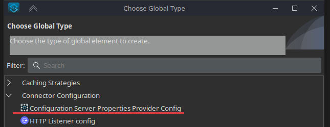
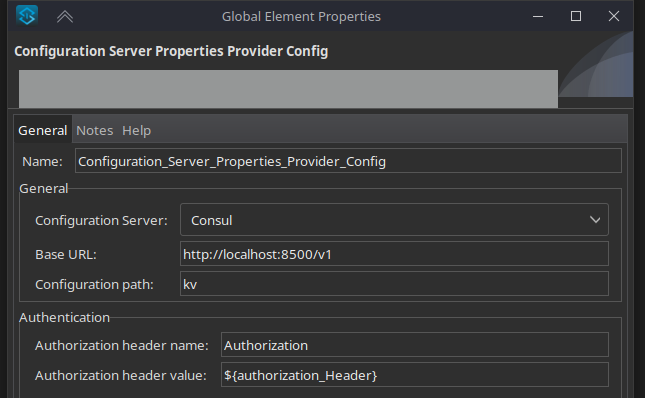
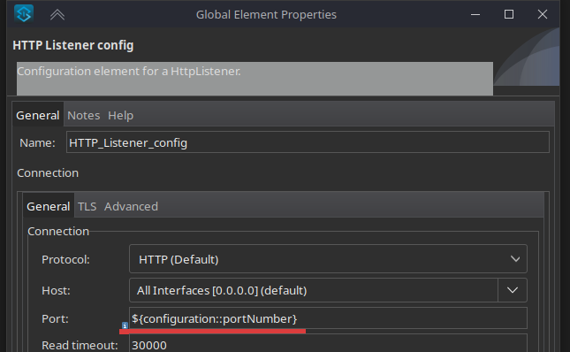

# Configuration Server Properties Provider

This MuleSoft connector allows to collect configuration properties from different configuration servers.
Currently you can use it with Tower, Consul or Spring Cloud.

## How to use it?

To start using this connector you'll need to build it with maven first.

```
mvn clean install -DskipTests
```

After the installation you'll be able to add it as the dependency to your application pom.xml

```
<groupId>pl.rpsoft.mule.provider</groupId>
<artifactId>configuration-server-properties-provider-module</artifactId>
<version>1.1.0-SNAPSHOT</version>
```

This operation will add and additional connector you can choose from called **Configuration Server Properties Provider
Config**





After you'll add it to your application, you'll be able to use any configuration property from the configuration server
you'll need. To do so, just add the **configuration::** prefix before the property name.



## Supported configuration servers

| Configuration server       | Home page                                                               |
|----------------------------|-------------------------------------------------------------------------|
| Tower                      | https://github.com/RPSoftCompany/tower                                  |
| Consul                     | https://www.consul.io/                                                  |
| Spring Cloud Config Server | https://docs.spring.io/spring-cloud-config/docs/current/reference/html/ |
